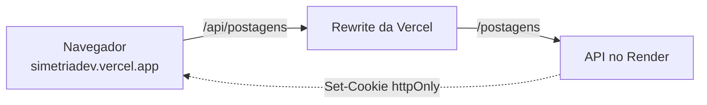

# Simetria.Dev

Front-end de uma plataforma de publicação de artigos, em React 19, TypeScript e
Tailwind 4. Sessão em cookie `httpOnly`, artigos em markdown, perfis públicos e
conformidade com a LGPD.


**Site:** [simetriadev.vercel.app](https://simetriadev.vercel.app) ·
**API:** [bruna-dsmendes/blog-pessoal](https://github.com/bruna-dsmendes/blog-pessoal)

## Sobre

Este projeto nasceu como o front de um CRUD de blog no Bootcamp Full Stack Java
da [Generation Brasil](https://www.generation.org/brasil/), com login guardando
o token no estado do React e todas as telas exigindo autenticação.

Foi reescrito junto com a API para virar uma plataforma de verdade: leitura
pública, editor de markdown com rascunho e publicação, perfis de autor abertos,
reações, e as telas que a LGPD exige.

As decisões e o que mudou estão em [MIGRACAO-FRONT.md](MIGRACAO-FRONT.md).

## Decisões de projeto

**O front não conhece o token.** A sessão vive num cookie `httpOnly`, que o
JavaScript da página não consegue ler. Com o token em `localStorage`, qualquer
XSS levaria a sessão embora, e este projeto renderiza markdown escrito por
terceiros, que é justamente um vetor de XSS.

**Quem responde "estou logada" é o servidor.** No boot, o `AuthContext` chama
`/usuarios/me`. Se voltar 200, existe sessão. Efeito colateral bom: recarregar a
página deixou de deslogar.

**A `baseURL` do axios é relativa.** As requisições saem para `/api` no mesmo
domínio da página. Chamar a URL da API direto faria o cookie virar cookie de
terceiro, que o Safari descarta. Em produção o rewrite da Vercel encaminha, e em
desenvolvimento o proxy do Vite faz o mesmo papel.



**A rota protegida espera a checagem terminar.** Sem isso, quem recarrega uma
página protegida é jogado no login por uma fração de segundo, antes de
`/usuarios/me` responder.

**Um interceptor concentra o 401.** No lugar do header montado à mão em cada
componente e do mesmo `catch` repetido, uma instância única do axios cuida de
credenciais e de sessão expirada.

**O feed não carrega o markdown.** A resposta de listagem não traz o campo
`conteudo`. Um artigo pode ter 50 mil caracteres, e devolver isso para cada item
seriam megabytes de JSON que a tela não usa.

**O markdown é renderizado sem HTML embutido.** O `react-markdown` não habilita
HTML por padrão, então uma tag injetada dentro do conteúdo vira texto em vez de
virar script. Adicionar `rehype-raw` abriria exatamente o buraco que se está
evitando.

**O botão de curtir usa atualização otimista.** O coração pinta antes da
resposta chegar e reverte se falhar. Curtida é ação pequena e frequente, e
esperar a rede deixa a interação com cara de travada.

**O painel das telas de entrada é só CSS.** Sem imagem externa: carrega
instantâneo, não depende de um link que pode cair, e mostra o produto em vez de
uma ilustração decorativa.

**Os documentos legais são markdown.** Ficam em `pages/legal/conteudo/`,
importados com `?raw` e renderizados pelo mesmo componente dos artigos. Atualizar
a política não exige tocar em componente. Abrem em modal para não tirar a pessoa
do cadastro, e as rotas `/privacidade` e `/termos` continuam existindo, porque
documento legal precisa de endereço estável.

## Tecnologias

React 19 · TypeScript · Vite 8 · Tailwind CSS 4 · React Router 7 · Axios ·
react-markdown · react-hook-form + Yup · react-toastify

## Rodando localmente

Requer Node 20+ e a [API](https://github.com/bruna-dsmendes/blog-pessoal)
rodando em `localhost:8080`.

```bash
git clone https://github.com/bruna-dsmendes/Blog_pessoal_react.git
cd Blog_pessoal_react

npm install
npm run dev
```

O site sobe em `http://localhost:5173`. O proxy configurado no `vite.config.ts`
encaminha `/api` para a API local, então não existe variável de ambiente para
configurar.

```bash
npm run build     # roda tsc e depois o build de produção
```

O `npm run dev` não checa tipos. Vale rodar o build de vez em quando, ou
`npx tsc --noEmit`, para não descobrir erro de tipo só no deploy.

## Deploy

Publicado na Vercel. O `vercel.json` faz duas coisas:

- encaminha `/api/*` para a API no Render, o que mantém o cookie de sessão como
  cookie primário
- devolve `index.html` para as demais rotas, necessário em SPA

Trocar a URL da API significa editar esse arquivo.

## Rotas

| Rota | Acesso |
|---|---|
| `/` | pública, feed com destaque e tags |
| `/artigo/:slug` | pública |
| `/tag/:slug` | pública |
| `/autor/:username` | pública, perfil e artigos do autor |
| `/privacidade`, `/termos` | pública |
| `/login`, `/cadastro`, `/esqueci-a-senha`, `/redefinir-senha` | pública |
| `/minhas-postagens` | sessão, inclui rascunhos |
| `/postagens/nova`, `/postagens/:id/editar` | sessão |
| `/perfil`, `/perfil/editar` | sessão |

## Estrutura

```
src
├── components      # navbar, rodapé, cards, editor, modal legal
├── contexts        # AuthContext, sessão baseada em cookie
├── models          # tipos do contrato da API
├── pages           # telas, uma pasta por rota
├── routes          # RotaProtegida
├── services        # instância do axios e chamadas por domínio
└── utils           # helpers
```

## Roadmap

- [x] Sessão em cookie httpOnly com invalidação ao trocar a senha
- [x] Editor de markdown com preview, rascunho e publicação
- [x] Perfil público de autor, com links e estatísticas
- [x] Reações, download dos dados e exclusão de conta
- [x] Política de privacidade e termos de uso
- [ ] Autocomplete de tags no editor
- [ ] Busca por termo na interface
- [ ] Carregar o `react-markdown` sob demanda para aliviar o bundle inicial

---

Desenvolvido por [Bruna Mendes](https://github.com/bruna-dsmendes).